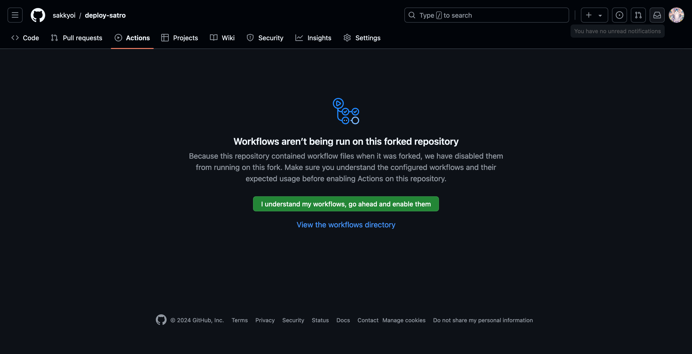
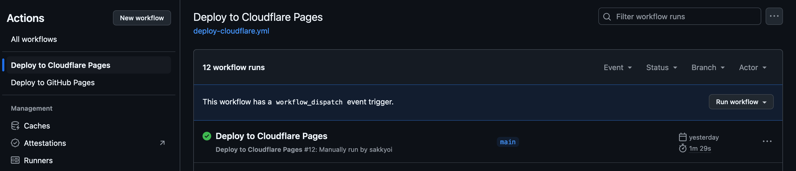

# deploy-satro

## Description

Satro is a ready-to-use static site generator that is built with [Astro](https://astro.build/). This repository is a template that you can use to deploy your site of [satro](https://github.com/sakkyoi/satro) to various platforms.

## Prerequisites

- [Deploy to Cloudflare Pages](./deploy-cloudflare.md)
- [Deploy to GitHub Pages](./deploy-github.md)

### Workflow not being run on forked repository

You may have noticed that the workflow isn't being run on your forked repository. This is because of security reasons. You can enable the workflow by just clicking on the `I understand my workflows, go ahead and enable them` button as shown below.


### Workflow dispatch

The workflow files provided in this repository are not triggered by push in default. You can trigger the workflow by using the `workflow_dispatch` event. You can find the `workflow_dispatch` event in the Actions tab of your repository.



Or you can remove the comment from the workflow file to trigger the workflow on push.

```diff
on:
  workflow_dispatch:
- # push:
- #   branches: [ "main" ]
+ push:
+   branches: [ "main" ]
```

## Configure site

Assuming you have already setting up the deploy workflow (including those environment variables starting with `SITE_`) mentioned in the [Prerequisites](#prerequisites) section.

### Announcement

You can create an announcement by creating a file in the `announcement` directory. Head to the [`announcement`](./announcement/) directory to find out more.

### Footer

You can create links or scripts in the footer by creating a file in the `footer` directory. Head to the [`footer`](./footer/) directory to find out more.

The icon attributes are using [Iconify](https://icon-sets.iconify.design/).

> **Note**: External scripts are allowed, for example, please refer to [footer/0_script-jquery.mdx](./footer/0_script-jquery.mdx).
>
> **Additionally**: The order of links and scripts is based on the file name, so you can prefix the file name with a number to set the order (e.g. `0_`, `1_`, `2_`, etc).

### Thumbnail, favicon and anything

You can put your thumbnail, favicon, or anything in the [`public`](./public/) directory which will be copied to the root of the site.

> **Note**: You can put your `thumbnail`, `favicon` in several formats simultaneously. But only one file will be used, which is randomly selected in the build process.

### Redirects

Redirects are available if you are deploying to Cloudflare Pages. You can create a file name `_redirects`(in this template, it's already created and will be automatically copied to the `public` directory) and follow the [Redirects](https://developers.cloudflare.com/pages/configuration/redirects/) documentation.

## Start authoring

### Article and image

You can create an article by creating a file in the `article` directory. Head to the [`article`](./article/) directory to find out more.

> **Note**: Path to the image in the article is not relativity, please start with `/` and put the image under the `image` directory. (sub directory is allowed)

### About code block

Code block in the article is using [Expressive Code](https://expressive-code.com/), you can find out more in their documentation.

> **Note**: `pluginCollapsibleSections` plugin is installed by default.

## Next steps

Congratulations! You have successfully completed the setup of your site. You can now start authoring your site, and don't forget to remove the those example files in the `announcement`, `footer`, `public`, and `article` directories.

## Something notable

Details about Astro, please refer to the [Astro documentation](https://docs.astro.build/).

Feel free to forked [satro](https://github.com/sakkyoi/satro) and modify it to suit your needs.

## Demo article

The live demo about how to authoring your content. [Example](https://satro-example.pages.dev/article/example/)

## License

This project is licensed under the LGPLv3 License - see the [LICENSE](./LICENSE) file for details.
