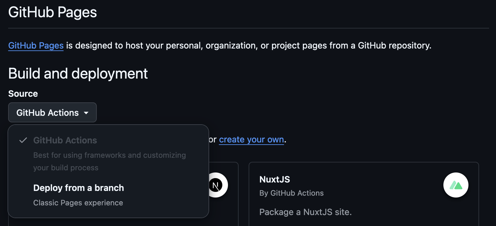
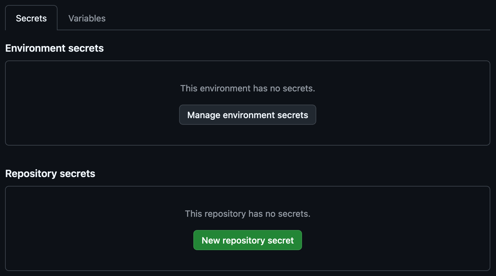
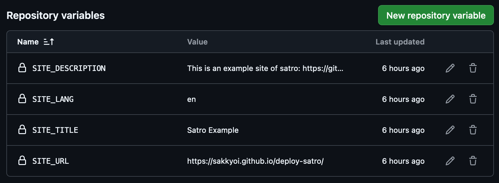

# Deploy to GitHub Pages

## Prepare repository

1. Fork this repository to your GitHub account.
2. Clone your forked repository to your local development environment.

## Prepare GitHub Pages

1. Head to the `Settings` tab of your forked repository and click on the `Pages` section. Then choose `GitHub Actions` as the `Build and deployment` source.

## Set up GitHub workflow

1. Head to the `Settings` tab of your forked repository and click on the `Security` > `Secrets and variables` > `Actions`

2. Add the following variables by clicking on the `New repository variable` button in the `Variables` tab.
    - `SITE_URL`: The URL of your site. (if you have a custom domain, you can use it, otherwise you can use the one that Cloudflare provides you.)
    - `SITE_TITLE`: The title of your site.
    - `SITE_DESCRIPTION`: The description of your site.
    - `SITE_LANG`: The language of your site. (e.g. `en`, `zh-TW`)

    
**Note:** If you want to use the url that GitHub provides you, it should be like this: `https://<username>.github.io/<repository-name>/`. Don't forget to set the `SITE_URL` variable to the whole URL including `/<repository-name>/`, or the page deployed will not work properly.
